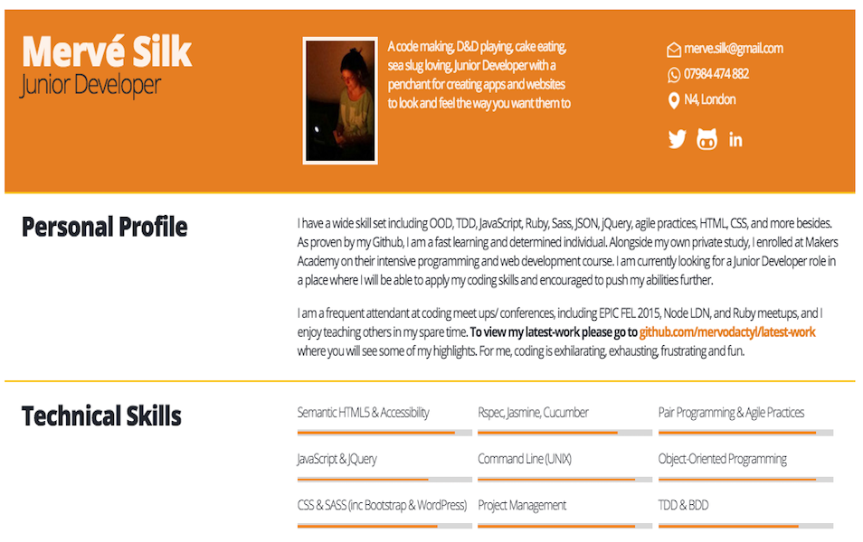
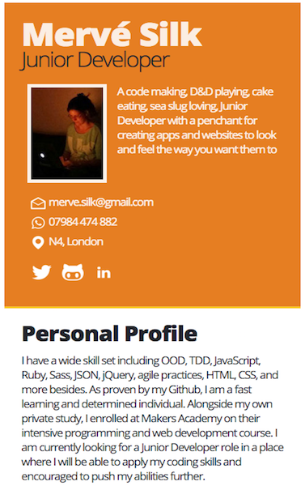

# mePage

## *Single page CV site detailing my history as a Developer*

## __TL;DR:__

I decided to create a site specifically dedicated to my CV

The standard Developer resume is traditionally written in Markdown, which for a Front End Developer is highly uninspiring. So unless I decided to use a lot of HTML within my [Markdown](https://help.github.com/articles/github-flavored-markdown/) file, I couldn't see it turning into anything particularly glamorous. Thats why I made a simple but effective version in [SCSS](http://sass-lang.com/)

 ego points ++++

Desktop View                                                               |  Mobile View
:-------------------------------------------------------------------------:|:----------------------------------------------------------------------:
 |  

## Its hard to be a Front End Dev and only use Markdown...

Using my own CV as a template for this project, I decided to use SCSS again as I am still in love with its [Mixins and Variables](http://sass-lang.com/guide) (having started this love affair in a [previous exercises](https://github.com/Mervodactyl/scssyDigimon)). I also wanted a more challenging Grid based project, and since I felt uninspired by the standard developer Markdown resume, it seemed a good idea to find another way to advertise my abilities.

## Tools

* SCSS
* HTML
* Normalize.css
* Photoshop

## Mistakes made and lessons learnt

I had the same problem again with SCSS, in that when it came to deciding when to actually implement the use of Mixins etc I found it difficult to deside when it was appropriate. Had I been working on a larger project, I believe it would have made the choices a lot easier (ie scalability and repetition would have mattered)

I wanted to use the Normalize reset as I agree with it more in principal when it comes to cross browser compatibility, however I had to overwrite several font principals when developing this page, so much so that in hindsight I should have used a reset

This point ties in well with the fact that despite using a Flat UI theme to begin with, I ended up not keeping entirely to the spec as it became apparent that removing some of its key features made this design sleeker and more modern. It is fair to say that 70% of the original design remained, most importantly the font stylings - which are where most of my Normalize.css over rides are

I enjoyed learning how to inverse some of the icons I used in my end design but it was not without much trail and error

## Conclusion

I love the newer Flat UI design and it was fun playing with SCSS again
